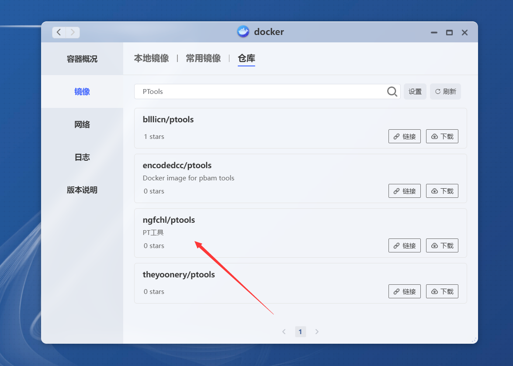
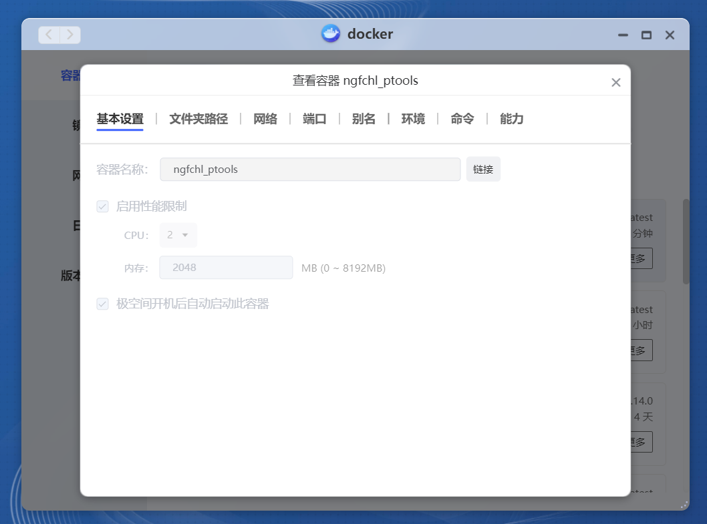
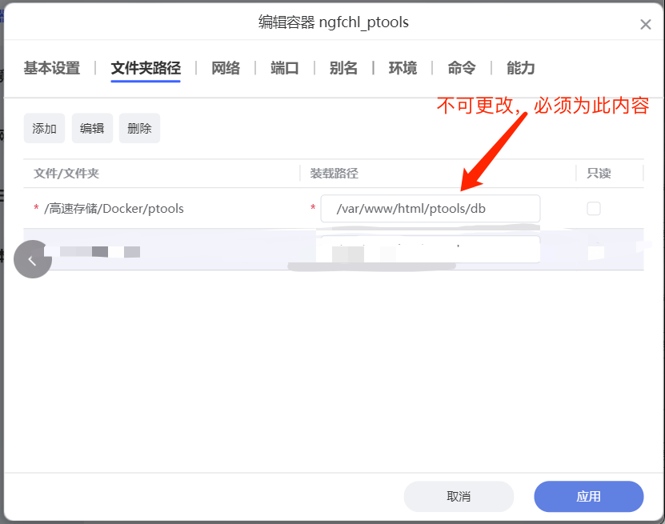
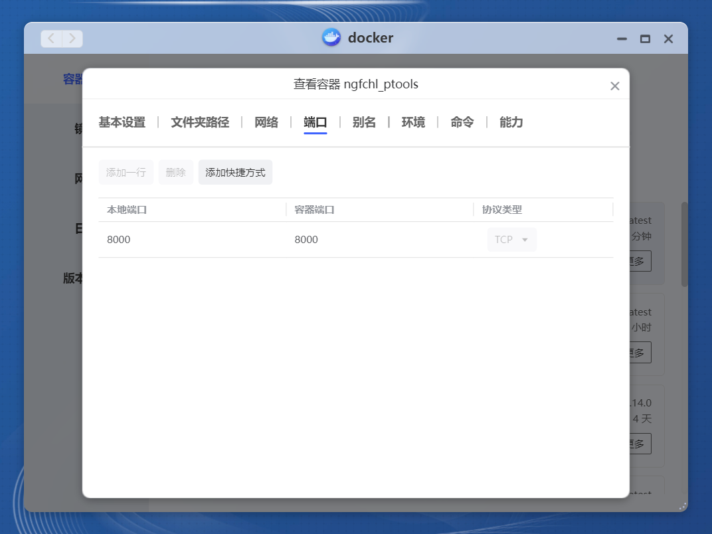
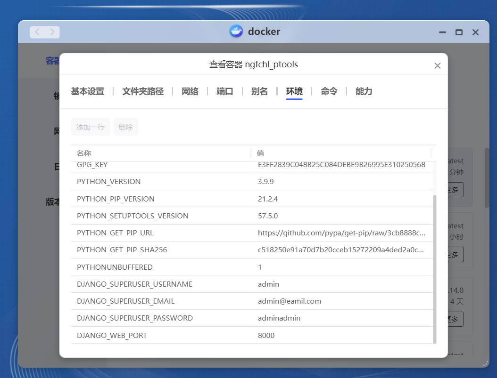

# 安装PTools

### 命令行安装

```bash
# -v 本地路径:容器路径，下面的是数据库路径/var/www/html/ptools/db，后面不能改
# -v docker、docker.sock 映射，用于实现点击页面按钮重启容器更新代码，:前的路径需要根据使劲情况更改，获取路径命令：`which docker`
# -p 端口映射，本地端口:容器端口，后面不能改
# -e 设置环境变量，这里用于配置工具登录账号和密码，可以删掉不写，会有默认值，在登录一项有写，登录之后都可以修改 
# DJANGO_SUPERUSER_USERNAME：用户名 
# DJANGO_SUPERUSER_EMAIL 邮箱 
# DJANGO_SUPERUSER_PASSWORD：密码
# DJANGO_WEB_PORT：自定义容器内部端口，用户HOST网络模式，一般不需要使用

# 最简单的部署
docker run -d \
-v /your-path/db:/var/www/html/ptools/db \
-p 8001:8000 \
ngfchl/ptools
# 直接自定义用户名密码
docker run -d \
-v /your-path/db:/var/www/html/ptools/db \
-p 8001:8000 \
-e DJANGO_SUPERUSER_USERNAME=admin \
-e DJANGO_SUPERUSER_EMAIL=example@example.com \
-e DJANGO_SUPERUSER_PASSWORD=adminadmin \
ngfchl/ptools

# 映射docker路径，实现容器内直接重启本容器，需要使用 which docker 自行查找docker路径
docker run -d \
-v /your-path/db:/var/www/html/ptools/db \
-v /var/run/docker.sock:/var/run/docker.sock \
-v /usr/bin/docker:/usr/bin/docker \
-p 8001:8000 \
--name=ptools \
ngfchl/ptools
# 宝塔
docker run -itd -v /www/wwwroot/ptools/db:/var/www/html/ptools/db  -v /var/run/docker.sock:/var/run/docker.sock -v /usr/bin/docker:/usr/bin/docker -p 8001:8000 --name=ptools ngfchl/ptools
# 群晖，群晖一定不要在root模式下搞，要使用sudo命令执行
sudo docker run -itd -v /volume1/docker/ptools/db:/var/www/html/ptools/db  -v /var/run/docker.sock:/var/run/docker.sock -v /usr/local/bin/docker:/usr/bin/docker -p 8001:8000 --name=ptools ngfchl/ptools
```

### 群晖安装

1.  下载镜像：ngfchl/ptools

    

2.  下载成功，点击启动

    

3.  配置容器，提前准备好文件夹，我的路径：volume1/docker/ptools

    

4.  选择网络，默认就好，不需要用host模式，但是，如果你的网络环境比较差，或者需要使用IP V6，那你最好使用HOST模式，连接性更好，并且与主机共享V6地址

    

5.  取好名字，开启自动重启

    

6.  打开高级设置，环境变量里面设置这三项就可以了，如果你使用host模式，而且端口8000与其他应用有冲突，可以修改最下方的WEB\_PORT为你喜欢的端口，保存，下一步

    

7.  配置访问端口，这里填上你喜欢的端口，host模式无需配置，未修改环境变量就是8000，修改了就是你修改的值，

    

8.  映射数据库文件夹，选择你想保存的文件夹，然后填上容器内部的路径：/var/www/html/ptools/db，这个路径是固定的，当然如果你懂docker，你看着搞就行

    

    

9.  下一步，完成启动容器，在容器状态中就可以查看日志了，也可以在终端机查看实时日志

    

    

10. 等待系统提示如下信息，就启动完成了！玩得开心

    

### 极空间安装

1.  搜索并下载镜像

    

2.  设置并启动容器

    1.  基本设置

        

    2\. 映射文件夹，装载路径必须为：`/var/www/html/db` ，不可更改

    

    3\. 端口映射，本地端口看你喜欢，容器端口必须为8000，如果你使用HOST模式，这一步无需映射

    

    4\. 环境变量设置，默认可以不用设置，但是如果你使用HOST模式，需要更改端口，可以在这里修改环境变量`  DJANGO_WEB_PORT  `为你喜欢的端口

    

3.  其他选项无需更改，保存启动，访问你配置的端口即可。

### UNRAID模板使用

1.  文件地址：[https://gitee.com/ngfchl/ptools/tree/master/docker\_templates](https://gitee.com/ngfchl/ptools/tree/master/docker_templates "https://gitee.com/ngfchl/ptools/tree/master/docker_templates")

2.  下载文件后，导入到unraid的/root/.docker/templates-user目录下（工具为：finalshell）

    

3.  然后在创建容器是就可以使用模板创建了

    

4.  根据需要修改自己的参数

    

5.  应用，安装完毕。
